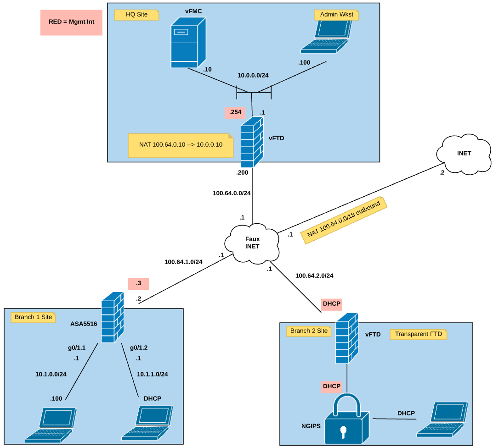

# Example topology with scripts
The point of this example is to configure the following topology exclusively via the fmcapi project.

## Prerequisites
The fmcapi talks to FMC and not the FTD/NGIPS devices directly so you will need to configure those devices to register 
to the FMC some other way (maybe the Ansible FTD modules?).

## Logic and Data
### Mixing logic (aka code) and data
When we first started this example we would program the python script (the logic) and reference the data directly in the script.
You can find that code in the 'mixed_logic_and_data' directory.
Pros:
*  Data added/gathered earlier in the python script can be referenced (less data duplication via reference).
*  The script can be "read" and you can pretty much see when/where data is being used.
Cons:
*  Changing data can be tricky.  You have to "read" the code to find the places that need updated.
*  Changing the logic of the code can be tricky as it is highly dependant (interwoven) with the data.
*  Sharing the script with others exposes your data to them.
*  Usually the code written is exclusive for the data provided.  This means additional data probably needs more code.

### Separating logic and data
The "new" way to write code is to separate the logic from the data.  This means importing a "data file" to be run against the code.
You can find that code example in the 'logic_separate_from_data' directory.  (The program_logic.py is the Python script to run.  
It references the userdata.yml file for it's content.)
Pros:
*  With data and logic separated the data can be "switched out" quickly with out having to read/modify the code.
*  The logic and be updated and tested against a sample dataset and then ONLY the code can be shared with other users.
*  In most cases adding more data doesn't require adding more code.
Cons:
*  The layout of the data in the dataset can be tricky.  For example, YAML is space sensitive.
*  The logic and data do have a "link" in that the code needs to know how to read the data.  If the data format changes then so needs the code.
*  Data being referenced in different places could be required to be duplicated (YAML doesn't have a 'reference' ability).

## FTD at HQ
We need to configure the FTD device at HQ prior to doing the branches because it is inline between the FMC and those branch devices.

Using the hq-ftd.py script we will accomplish the following:
* Creates ACP and associated ACP Rule.
* Creates Security Zones.
* Creates Network Objects.
* Builds a NAT Policy and NAT rules.
* Registers the hq-ftd device to the FMC.
* Updates hq-ftd interfaces with IP addresses.
* Creates static default route.
* Associated hq-ftd with the NAT policy.
* Deploys changes to hq-ftd.
